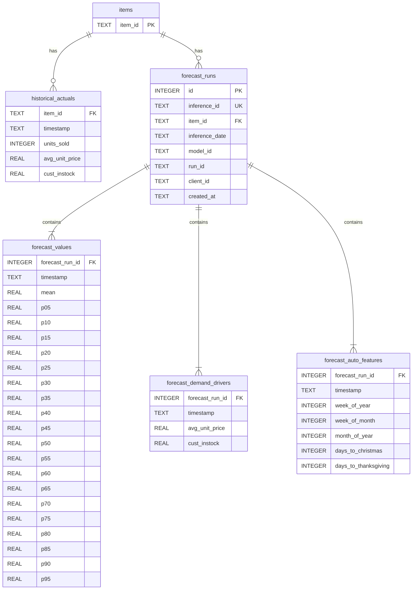

# Backend Design Plan: Demand Planning Dashboard

## Data Summary (from exploration)

- **aggregated_data.csv**: 25,842 rows, 166 SKUs, weekly history from 2021-04-04 to 2025-04-20
- **forecast_data.csv**: 2,112 rows, 132 SKUs, 16 inference dates (2025-01-05 to 2025-04-20), each with 40-week forecast horizon
- 132 SKUs have both history and forecasts; 34 SKUs have history only
- The "current week" is `max(inference_date)` = **2025-04-20**; forecasts start from **2025-04-27**

---

## Project Structure

```
backend/
  app/
    __init__.py
    main.py              # FastAPI app, CORS, lifespan
    database.py          # SQLite connection, schema creation
    models.py            # Pydantic response models
    routers/
      items.py           # /api/items endpoints
      aggregate.py       # /api/aggregate endpoints
      alerts.py          # /api/alerts endpoint
  scripts/
    load_data.py         # One-time CSV -> SQLite loader
  requirements.txt
  demand_planning.db     # Generated SQLite database (gitignored)
```

---

## Database Schema (SQLite)

Six normalized tables. All dates stored as `TEXT` in `YYYY-MM-DD` format.



### Key design decisions

- `**demand_drivers` in `aggregated_data.csv**` is a single JSON object per row -- flattened into `avg_unit_price` and `cust_instock` columns directly on `historical_actuals`
- `**forecasts` array (40 entries per row) is exploded into `forecast_values` -- one row per (forecast_run, week), with `mean` + 19 percentile columns (`p05` through `p95`)
- `**demand_drivers` array in `forecast_data.csv` (41 entries) is exploded into `forecast_demand_drivers`
- `**forecast_runs` uses an auto-increment `id` as FK for child tables to avoid repeating long `inference_id` strings everywhere
- Indexes on `(item_id)`, `(item_id, inference_date)`, and `(forecast_run_id)` for fast lookups

### Row count estimates

| Table                   | Rows                 |
| ----------------------- | -------------------- |
| items                   | ~166                 |
| historical_actuals      | ~25,842              |
| forecast_runs           | ~2,112               |
| forecast_values         | ~84,480 (2,112 x 40) |
| forecast_demand_drivers | ~86,592 (2,112 x 41) |
| forecast_auto_features  | ~86,592 (2,112 x 41) |

---

## Data Loading Script (`scripts/load_data.py`)

A standalone Python script that:

1. Creates the SQLite database and all tables (idempotent with `CREATE TABLE IF NOT EXISTS`)
2. Parses `aggregated_data.csv`:

- Collects unique `item_id` values into `items`
- Flattens `demand_drivers` JSON and inserts into `historical_actuals`

1. Parses `forecast_data.csv`:

- Inserts metadata into `forecast_runs`, gets back the auto-increment `id`
- Explodes `forecasts` JSON array into `forecast_values`
- Explodes `demand_drivers` JSON array into `forecast_demand_drivers`
- Explodes `auto_features` JSON array into `forecast_auto_features`

1. Uses batch inserts (`executemany`) with transactions for performance
2. Creates indexes after bulk insert

Libraries: only `csv`, `json`, `sqlite3` (all stdlib).

---

## REST API Endpoints (FastAPI)

All endpoints return JSON. The API determines the "latest inference date" at startup (`max(inference_date)` from `forecast_runs` = 2025-04-20) and uses it as the default for all forecast queries.

### Items

| Method | Path         | Description                                                                                                               |
| ------ | ------------ | ------------------------------------------------------------------------------------------------------------------------- |
| GET    | `/api/items` | List all SKUs. Returns `[{item_id, has_forecast, latest_inference_date}]`. Supports `?search=` query param for filtering. |

### Per-SKU Endpoints

| Method | Path                                         | Description                                                                                                                                                      |
| ------ | -------------------------------------------- | ---------------------------------------------------------------------------------------------------------------------------------------------------------------- |
| GET    | `/api/items/{item_id}/actuals`               | Historical weekly actuals. Query params: `?weeks=N` (default: all). Returns `[{timestamp, units_sold, avg_unit_price, cust_instock}]`                            |
| GET    | `/api/items/{item_id}/forecast`              | Latest inference forecast (mean + all percentiles). Query params: `?inference_date=` (default: latest). Returns `[{timestamp, mean, p05...p95}]`                 |
| GET    | `/api/items/{item_id}/demand-drivers`        | Combined historical + projected demand drivers. Returns `{historical: [...], projected: [...]}` where each entry has `{timestamp, avg_unit_price, cust_instock}` |
| GET    | `/api/items/{item_id}/previous-year-actuals` | Same-week actuals from one year prior (for YoY comparison on Page 2). Returns `[{timestamp, units_sold}]`                                                        |

### Aggregate Endpoints (for Page 1 -- Home)

| Method | Path                   | Description                                                                                                                                                                                  |
| ------ | ---------------------- | -------------------------------------------------------------------------------------------------------------------------------------------------------------------------------------------- |
| GET    | `/api/aggregate/chart` | Last 13 weeks of summed `units_sold` across all SKUs + next 39 weeks of summed forecast `mean`. Returns `{historical: [{timestamp, total_units_sold}], forecast: [{timestamp, total_mean}]}` |

### Alerts

| Method | Path          | Description                                                                                                                                                                                                            |
| ------ | ------------- | ---------------------------------------------------------------------------------------------------------------------------------------------------------------------------------------------------------------------- |
| GET    | `/api/alerts` | Items flagged for forecast accuracy issues. Computes MAPE by comparing prior inference forecasts to realized actuals. Returns `[{item_id, mape, direction, recent_actual, recent_forecast}]` sorted by worst accuracy. |

**Alert logic**: For each SKU, take the second-to-latest inference run and compare its predicted `mean` for overlapping weeks against actual `units_sold`. Compute MAPE (Mean Absolute Percentage Error). SKUs with MAPE above a threshold (e.g., 30%) are flagged. `direction` indicates "over-forecast" or "under-forecast".

### Metadata

| Method | Path                        | Description                                                               |
| ------ | --------------------------- | ------------------------------------------------------------------------- |
| GET    | `/api/meta/inference-dates` | Returns all available inference dates (useful for UI dropdowns if needed) |

---

## Response Models (Pydantic)

Key models in `models.py`:

- `ItemSummary(item_id, has_forecast, latest_inference_date)`
- `ActualRecord(timestamp, units_sold, avg_unit_price, cust_instock)`
- `ForecastRecord(timestamp, mean, p05, p10, ..., p95)`
- `DemandDriverRecord(timestamp, avg_unit_price, cust_instock)`
- `AggregateChartResponse(historical: list, forecast: list)`
- `AlertItem(item_id, mape, direction, recent_actual, recent_forecast)`

---

## Cross-Cutting Concerns

- **CORS**: Enabled for `localhost:3000` (Next.js dev server) via `CORSMiddleware`
- **Error handling**: 404 for unknown `item_id`, validation via Pydantic
- **Database connection**: Single SQLite file, connection per request using a dependency
- **Startup**: `load_data.py` is a separate script run once; the API just reads the DB

---

## Dependencies (`requirements.txt`)

```
fastapi
uvicorn[standard]
```

No ORM -- direct `sqlite3` queries for simplicity and full SQL control. No additional dependencies needed since CSV/JSON parsing uses Python stdlib.
